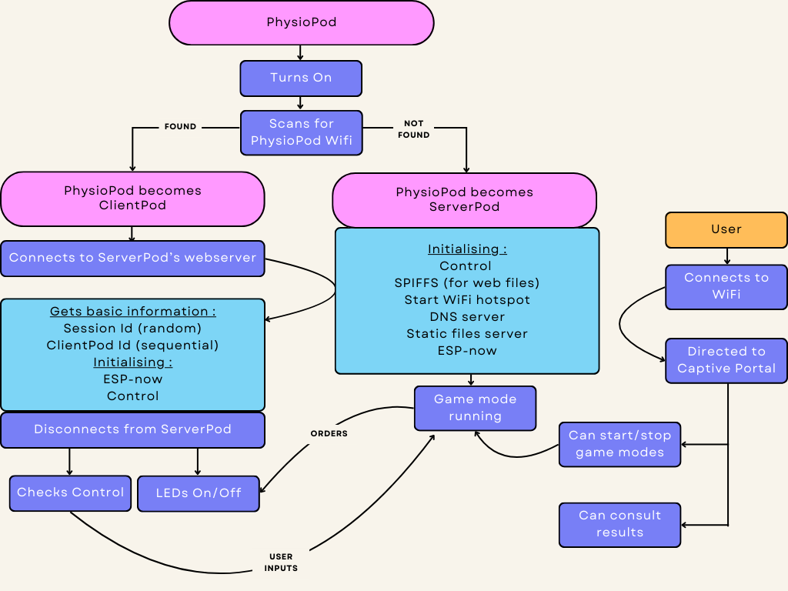

# Physiopods

## Qu'est-ce que c'est ?
Le but de ce projet est de créer des objets (des pods), utilisés pour jouer, pour la performance sportive ou pour la santé. Différents modes de jeu sont possibles, mais il est par exemple proposé un jeu de réflexes ou il faut appuyer le plus vite possible sur un pod lorsqu'il s'allume. Le score est alors basé sur le délai qu'a mis le joueur, mais aussi sur d'éventuelles erreurs (s'il a appuyé sur un pod éteint).

### Produits similaires
L'idée n'est pas nouvelle. De nombreux produits similaires existent [commercialement](https://www.joueclub.fr/jeux-de-societes/quick-touch-8421134091719.html), ou en projets [open-source](https://github.com/projectswithalex/Reaction-Lights-Training-Module/tree/Version-2).
Nous avons souhaité proposer une alternative avec des objectifs qui nous semblent différents.

### Objectifs du projet
- Nombre de pods : il doit être possible d'utiliser **beaucoup** de pods (la limite actuelle est de 255). Tous les pods sont interchangeables, il n'y a pas de maître ou d'esclave.
- Bon marché : le coût de revient ne doit pas être trop important. Il doit aussi être possible de réparer, de changer des composants ou la batterie.
- Interface web : pour éviter de multiplier les boutons, le gros de l'interface est proposée sur un site web hébergé par les pods. On peut y choisir un mode de jeu, consulter des résultats ou régler des paramètres.
- Polyvalent : les pods doivent pouvoir être posés au sol, fixés avec des sangles ou des ventouses pour permettre des usages différents. De même, le code est prévu pour qu'il soit assez facile d'ajouter d'autres contrôleurs (passer d'un bouton à un capteur capacitif, à un capteur de proximité ou encore à un capteur piezo)

## Comment créer mes propres pods
On y travaille... Il va falloir acheter des composants (liste à venir), les assembler (instructions à venir) et les placer dans un boîtier (fichiers à imprimer à venir).

Listes des composants :
- ESP :
- Module de charge : TP4056
- Batterie :
- Interrupteur 2 positions :
- Ring Led : 
- Capteur Piezo :

  Feuille de route des différents composants : https://lite.framacalc.org/qh2ci1g483-a8e7

## Comment ça marche ?
Les Physiopods reposent sur des ESP32. De nombreuses options doivent être possibles, mais les tests ont surtout été faits sur des [ESP32-S3](https://www.espressif.com/en/products/socs/esp32-s3). Ces composants sont capables de créer un réseau wifi, ce qui permet à tous les pods de se connecter entre eux, mais aussi à l'utilisateur de se connecter. Il est alors redirigé vers l'interface utilisateur, qui va lui permettre d'interragir avec les pods (par exemple pour lancer une partie, ou pour consulter les scores).

### Architecture générale
Tous les pods sont interchangeables, mais le premier pod allumé va prendre un rôle différent et sera désigné comme ServerPod : c'est lui qui va créer le réseau wifi et c'est lui qui centralisera tout. Les autres pods seront des ClientPod et ne feront que recevoir des ordres du ServerPod (par exemple pour qu'il s'allume en vert clignotant), ou pour envoyer des informations au ServerPod (par exemple pour dire qu'il a été activé par le joueur).

